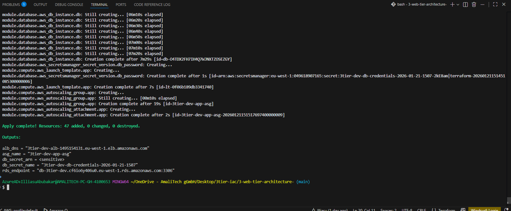
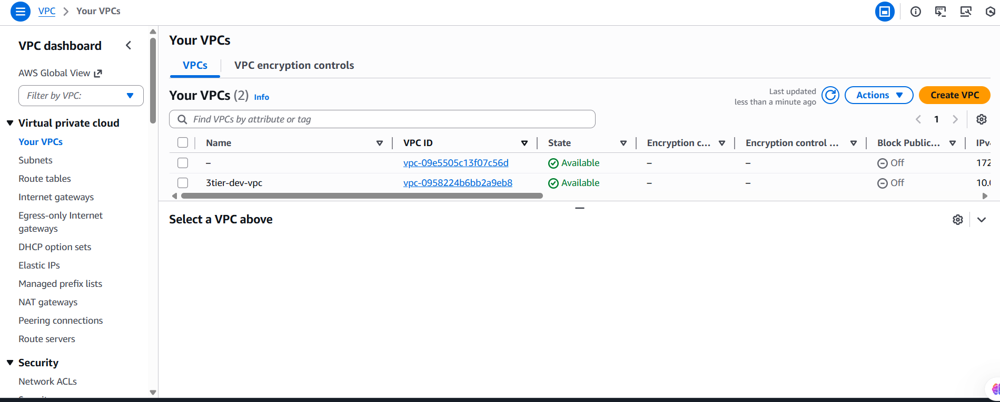
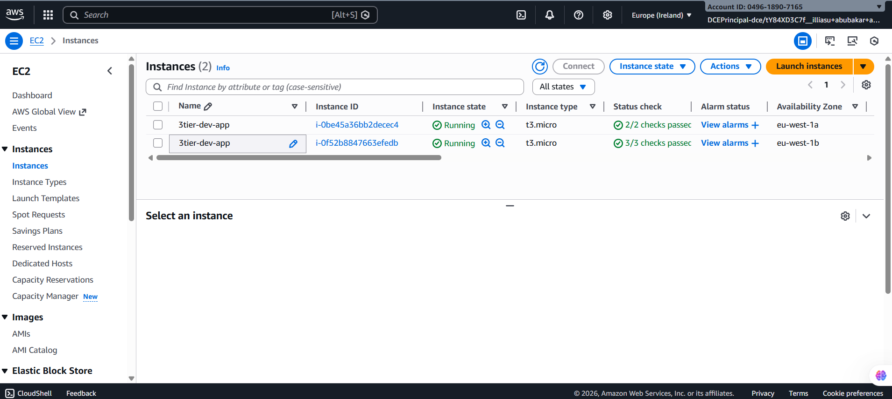
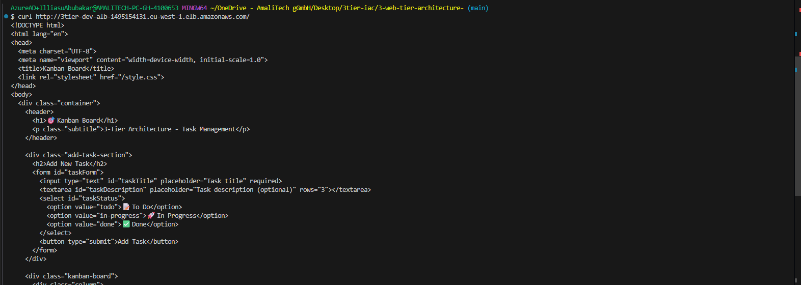
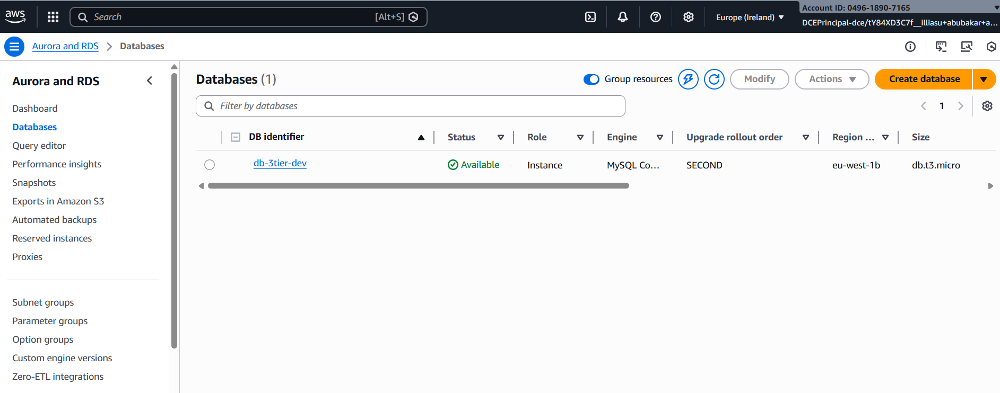

# 3-Tier Web Application Infrastructure

A scalable, secure 3-tier web application infrastructure deployed on AWS using Terraform. This project implements a Kanban task management application with proper separation across presentation, application, and data tiers.

##  Architecture


The infrastructure uses a classic 3-tier pattern:

### **Tier 1: Presentation Layer**
- Application Load Balancer in public subnets
- Distributes HTTP traffic across multiple Availability Zones
- Health checks on application endpoints

### **Tier 2: Application Layer**
- Auto Scaling Group with EC2 instances in private subnets
- No direct internet access (NAT Gateway for outbound)
- Secure access via AWS Systems Manager (no SSH keys)

### **Tier 3: Data Layer**
- RDS MySQL in isolated private database subnets
- Database credentials stored in AWS Secrets Manager
- Encryption at rest and automated backups

##  Project Structure

```
3-web-tier-architecture-/
├── main.tf                 # Root module orchestration
├── variables.tf            # Input variables
├── outputs.tf             # Output values
├── provider.tf            # AWS provider configuration
├── modules/
│   ├── networking/        # VPC, subnets, routing, NAT gateway
│   ├── security/          # Security groups and IAM roles
│   ├── alb/              # Application Load Balancer
│   ├── compute/          # EC2 instances, Auto Scaling Group
│   └── database/         # RDS instance and secrets
└── scripts/
    └── user-data.sh      # EC2 initialization script
```

##  Deployment

### Prerequisites
- AWS CLI configured with appropriate permissions
- Terraform >= 1.0 installed

### Steps

```bash
# Initialize Terraform
terraform init

# Review planned changes
terraform plan

# Deploy infrastructure
terraform apply

# Get ALB DNS name
terraform output alb_dns
```

Access your application at: `http://<alb-dns-name>/`

## 📊 Key Variables

| Variable | Description | Default |
|----------|-------------|---------|
| `aws_region` | AWS deployment region | `eu-west-1` |
| `environment` | Environment name | `dev` |
| `vpc_cidr` | VPC CIDR block | `10.0.0.0/16` |
| `instance_type` | EC2 instance type | `t3.micro` |
| `db_name` | Database name | `kanbandb` |

## 📸 Infrastructure Screenshots

### Terraform Deployment Output

*Successful deployment with ALB DNS, RDS endpoint, and ASG details*

### VPC Network Architecture

*VPC with public and private subnets across multiple Availability Zones*

### EC2 Instances & Auto Scaling

*Running EC2 instances managed by Auto Scaling Group in private subnets*

### Application Load Balancer Testing

*Successful HTTP connectivity test to ALB endpoint*

### RDS Database

*MySQL RDS instance in private database subnets*

## 🔍 Testing Connectivity

### Test ALB
```bash
# Get ALB DNS
terraform output alb_dns

# Test application
curl http://<alb-dns-name>/

# Test health endpoint
curl http://<alb-dns-name>/health
```

### Access EC2 via SSM
```bash
# Connect to instance (no SSH keys needed)
aws ssm start-session --target <instance-id>

# Test database connectivity from within instance
mysql -h <rds-endpoint> -u admin -p

# Ping other instances
ping <private-ip>
```

## 🛡️ Security Features

- **Network Isolation**: Multi-tier subnet architecture
- **Security Groups**: Restrictive rules following least privilege
- **No SSH Keys**: Secure access via AWS Systems Manager
- **Encrypted Storage**: RDS encryption with AWS managed keys
- **Secrets Management**: Database credentials in Secrets Manager
- **Private Subnets**: Application and database have no direct internet access

## 🔧 Maintenance

### Scaling
Modify Auto Scaling parameters in `modules/compute/variables.tf`

### Updates
- Application updates trigger rolling deployment
- Database schema changes via SSM sessions

### Backup & Recovery
- RDS automated backups with 7-day retention
- Point-in-time recovery available

## 🧹 Cleanup

```bash
terraform destroy
```

**Warning**: This permanently deletes all resources including the database.

## 📝 Notes

- Optimized for development/testing environments
- For production: enable Multi-AZ RDS, add monitoring, security hardening
- Single NAT Gateway design reduces costs but creates single point of failure
- Add SSL/TLS via AWS Certificate Manager for HTTPS support

